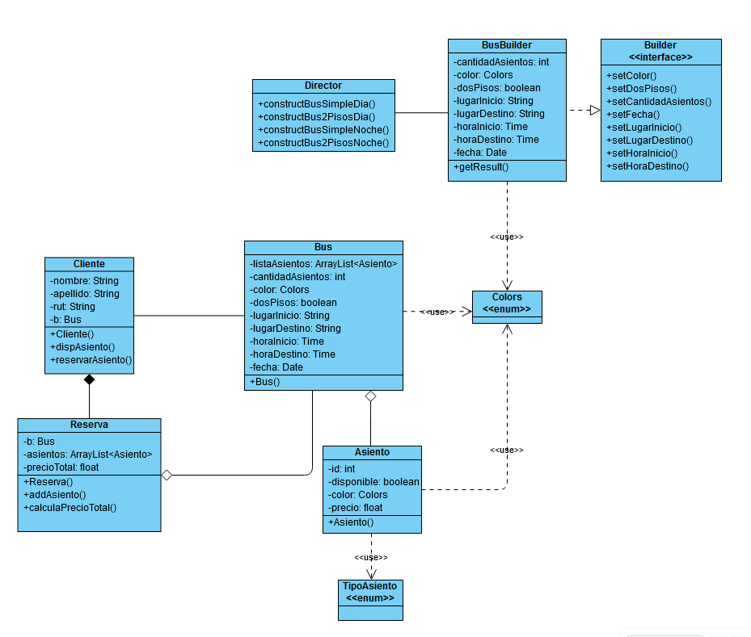
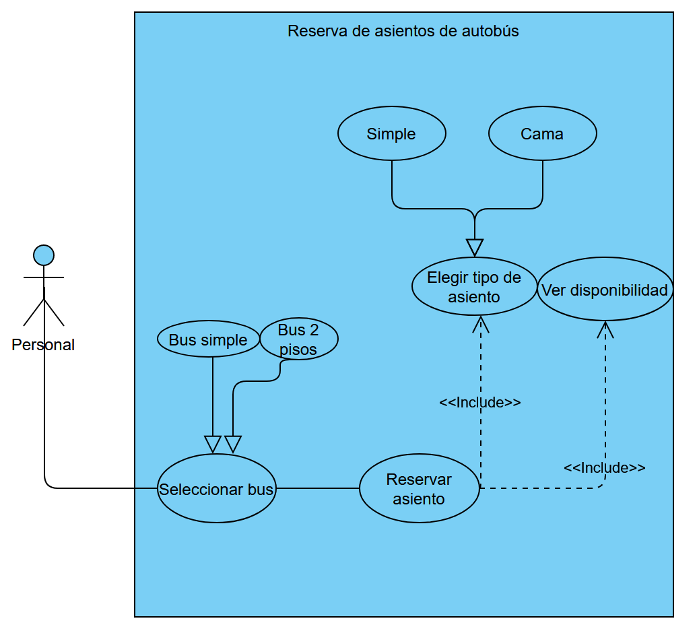

# Integrantes (Grupo 12)
- Martin Alonso Lara Castro
- Benjamín Cristobal Villarroel Rubio

# Proyecto final
Tema: Sistema de reserva de asientos de autobús.

Como características principales dadas por enunciado y referente, se nos pide lo siguiente:
- Poder escoger el viaje (bus) con información básica sobre el mismo (inicio, destino, fecha, tipo de bus, etc.)
- Seleccionado ya el bus, poder visualizar sus asientos, que a su vez sean distintivos dependiendo del tipo (simple, cama, semicama) y de su disponibilidad.
- Elegir uno o más asientos para poder realizar una reserva.
- Entregar la información completa de la reserva (Bus del viaje, asientos reservados, precio a pagar, datos del cliente, etc.).

# Diagrama de clases UML
Diagrama UML del modelo:

Diagrama UML del GUI:
// working

# Diagrama de casos de uso

Sujeto a modificaciones durante la implementación

# Patron de diseño utilizado
Consideramos que el patrón de diseño que más se adecuó a lo que queriamos implementar fue el patrón Builder, pues de esta manera nos ahorraríamos tener que trabajar con constructores con demasiados parámetros, y nos entrega mayor versatilidad para crear distintas variantes de buses (distintos pisos, colores, fechas/horas de salida, etc.). Además, de alguna manera nos simplificó la tarea de realizar tantas herencias, que inicialmente era como iba a ser nuestra implementación.

# Captura de pantalla de la interfaz
// working
# Decisiones a tomar
Al principio una decisión complicada fue determinar el patrón que queriamos utilizar, estabamos entre Factory Method y Builder. Pero tras un estudio a profundidad de cada uno, y comparandolo con nuestro objetivo a implementar, concluimos que lo más conveniente era el patrón Builder.
También tuvimos que decidir cómo distribuir los asientos en un principio, se pensó en utilizar matrices, pero finalmente concluimos que el uso de ArrayList iba a ser lo más adecuado para almacenar objetos Asiento.
# Problemas
Algunos de los problemas han sido no realizar constantemente la interacción/conexión entre modelo y GUI, que en un principio postergamos bastante y se pudo haber evitado con una mejor gestión y actividad. También un problema persistente ha sido uno relacionado con git, que era ocasionado por cambios constantes en el archivo workspace.xml y trajo como consecuencia hacer múltiples merge por resolución de conflictos, pero consideramos que esto es meramente por falta de experiencia, y también lo hemos logrado solucionar cada vez que se presentó.

