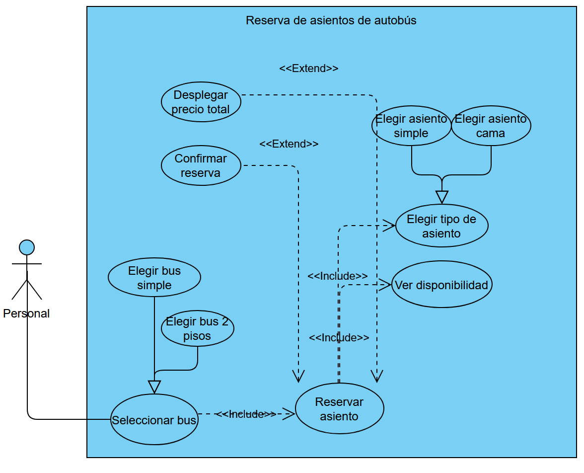

# Proyecto final
Sistema de reserva de buses

# Integrantes
- Martin Alonso Lara Castro
- Benjamín Cristobal Villarroel Rubio

# Diagrama de casos de uso

Sujeto a modificaciones durante la implementación

Por hacer:
- Subir el prototipo de interfaz
- Implementar ventanas con información del bus (asientos, cantidad, disponibilidad, tipos, etc.)
